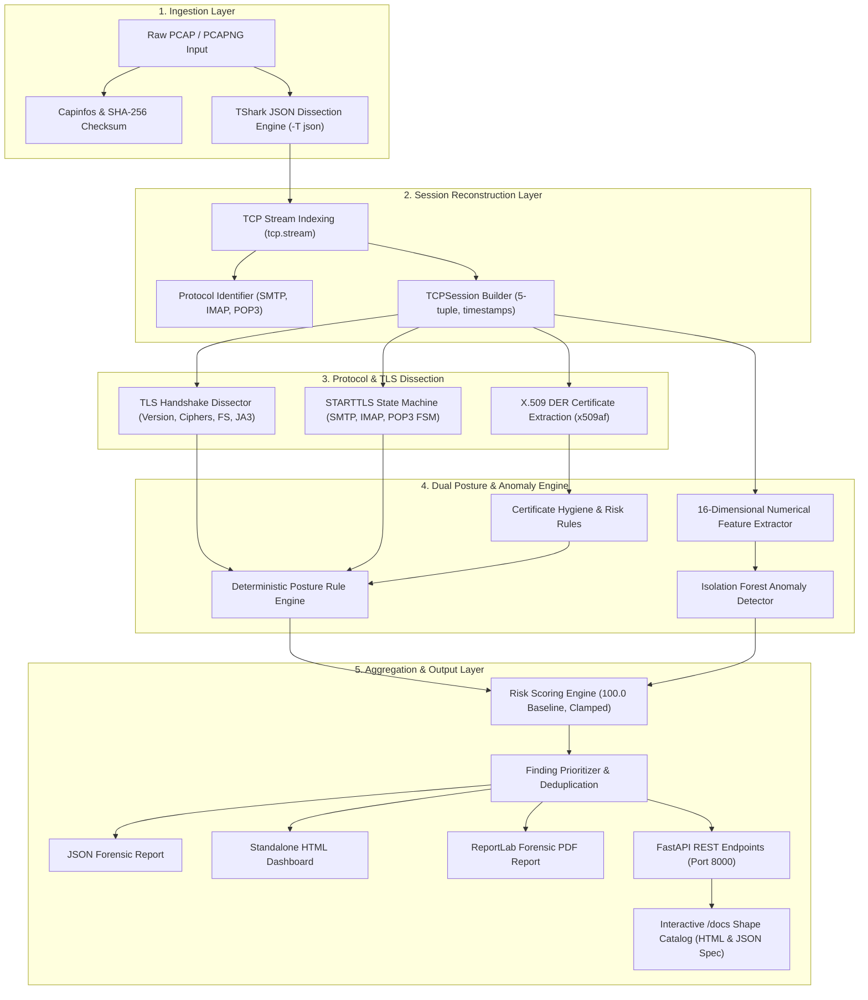
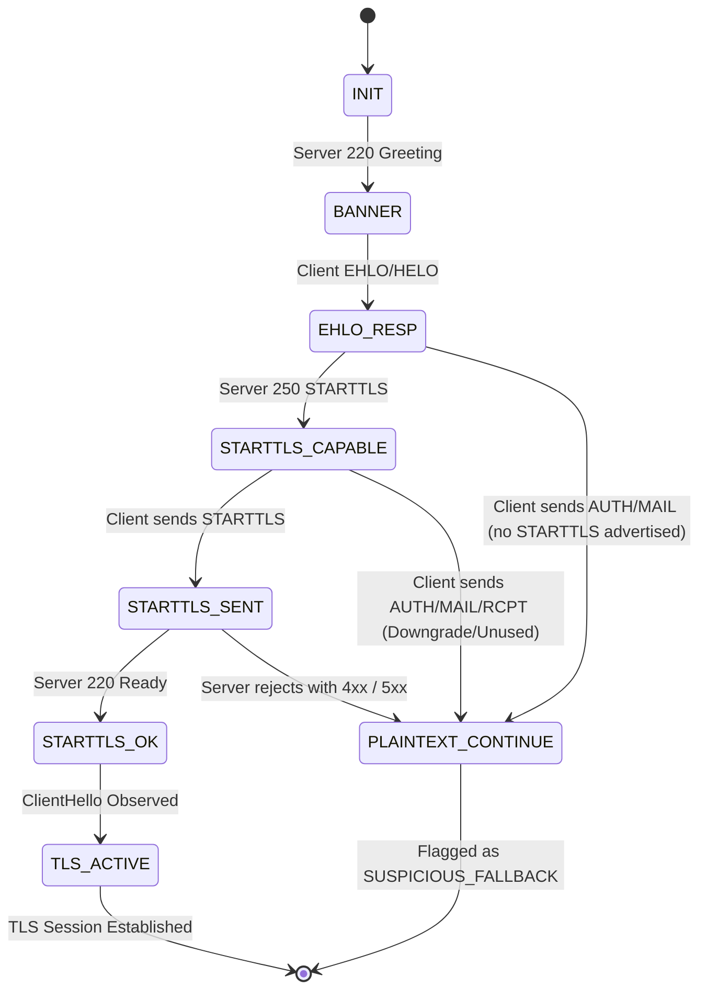
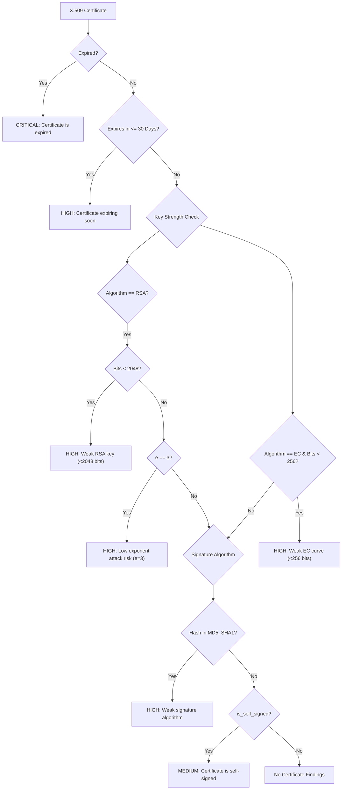

# Detailed Project Report (DPR): SecureMailScope
## AI-Assisted Cryptographic Security Posture Assessment for Secure Email Communications

> **Document Type:** Detailed Project Report (DPR)  
> **Target Problem Statement:** Smart India Hackathon (SIH 2026) — Problem Statement 26159 (PS 26159)  
> **System Classification:** Passive Network Forensic & Cryptographic Security Posture Framework  
> **Architecture:** Headless Forensic Microservice & REST Engine (Zero Frontend Dependencies)  
> **Automated Test Baseline:** 111 Pytest Unit Tests Passing (100% Coverage Across Core Engines)  
> **Audit & Release Date:** October 2026  
> **Authors:** SecureMailScope Engineering Team  

---

## 1. Executive Summary & Problem Formulation

### 1.1 Problem Statement Context
Email protocols remain the backbone of organizational communication, inter-agency information exchange, and critical infrastructure coordination worldwide. However, the fundamental protocols underpinning electronic mail—**Simple Mail Transfer Protocol (SMTP, RFC 5321)**, **Internet Message Access Protocol (IMAP, RFC 3501)**, and **Post Office Protocol version 3 (POP3, RFC 1939)**—were originally designed without transport security, transmitting commands, credentials, and message content entirely in cleartext.

To retrofit encryption onto legacy cleartext channels without disrupting backwards compatibility, the Internet Engineering Task Force (IETF) introduced the opportunistic **STARTTLS** mechanism (RFC 3207 for SMTP, RFC 2595 for IMAP/POP3), alongside direct implicit TLS transport (RFC 8314). While opportunistic encryption substantially improved day-to-day confidentiality, its opportunistic nature introduced grave systemic vulnerabilities:

1. **STARTTLS Downgrade & Stripping Attacks:** Active network adversaries (man-in-the-middle / MitM) can tamper with cleartext server capability advertisements (e.g., stripping `250-STARTTLS` from an `EHLO` response) or inject transient handshake rejections (e.g., `454 TLS not available`). In default configurations, mail transfer agents (MTAs) and mail user agents (MUAs) fail open, reverting silently to unencrypted transmissions and transmitting authentication credentials (`AUTH PLAIN`, `AUTH LOGIN`, `USER`, `PASS`) in plaintext.
2. **Cryptographic Decay & Legacy Compatibility:** Mail gateways routinely maintain backwards compatibility with deprecated, cryptographically broken protocol versions (SSL 2.0, SSL 3.0, TLS 1.0, TLS 1.1), obsolete stream/block ciphers (RC4, 3DES Sweet32 CVE-2016-2183, EXPORT, NULL), and key exchanges lacking Ephemeral Forward Secrecy (static RSA key transport).
3. **X.509 Certificate Hygiene Deficits:** Expired certificates, untrusted self-signed root certificates, weak RSA key lengths (<2048-bit), and legacy signature hashing algorithms (MD5, SHA-1) often persist indefinitely in passive mail traffic because automated MTAs frequently disable strict certificate validation to avoid delivery failures.
4. **Behavioral & Transport Anomalies:** Malicious traffic, protocol fuzzers, or misconfigured MTAs often introduce command pipelining violations, non-standard TLS extension distributions, or corrupted handshake fragments that evade static signature checks but deviate statistically from benign enterprise email behavior.

### 1.2 System Mission & Core Philosophy
**SecureMailScope** is an AI-assisted passive network forensic framework designed to ingest raw Packet Capture (`.pcap` / `.pcapng`) files, reconstruct bidirectional TCP email sessions, parse multi-stage STARTTLS negotiation state machines, dissect TLS handshakes, validate X.509 certificate hygiene, evaluate cryptographic posture against a deterministic rule engine, and score statistical behavioral outliers using an unsupervised Machine Learning (Isolation Forest) model.

The system is architected around five non-negotiable principles:

- **Zero Payload Retention (Privacy by Design):** Forensic extraction is strictly limited to network headers, protocol command verbs (e.g., `EHLO`, `STARTTLS`, `AUTH`), and TLS handshake metadata. Email bodies, message text, and user data are never inspected, extracted, or persisted.
- **Dual-Engine Detection (Deterministic + Probabilistic):** Deterministic rules handle known CVEs, protocol standards, and cipher suites with 100% precision. The Machine Learning engine models multidimensional feature space to flag subtle, anomalous handshakes that evade static heuristics.
- **Traceable Evidence Provenance:** Every security finding is directly linked to specific packet frame numbers, TCP stream identifiers, and observed protocol field values.
- **Respect for Cryptographic Boundaries (TLS 1.3 Handling):** In strict adherence to RFC 8446, SecureMailScope correctly identifies that TLS 1.3 encrypts handshake certificates and explicitly documents this observability boundary rather than hallucinating or erroring.
- **Zero-Dependency Reproducibility:** Operates entirely offline without external mail servers or network access, backed by reproducible Nix flakes, Scapy synthetic packet synthesis, and rootless Podman/Docker Compose containerization.

---

## 2. Technical Architecture & End-to-End Processing Pipeline

The following diagram illustrates the data flow and component hierarchy implemented in the codebase:



### 2.1 Complete Execution Flow (`backend/pcap/pipeline.py`)
When a PCAP is supplied to `analyse_pcap(pcap_path, analysis_id)`:
1. **Metadata Hashing:** Computes SHA-256 file digest, file size, duration, and frame count.
2. **Stream Grouping:** Groups raw dissected packet frames by `tcp.stream`.
3. **Session Instantiation:** Constructs `TCPSession` instances representing distinct network conversations identified by their 5-tuple (`src_ip`, `src_port`, `dst_ip`, `dst_port`, `ip.proto`).
4. **Application Protocol Identification:** Evaluates well-known ports and signature command banners (`EHLO`, `220`, `* OK`, `+OK`).
5. **Protocol State Machine Execution:** Tracks negotiation state transitions and identifies downgrade/stripping attempts.
6. **TLS Handshake Parsing:** Extracts offered/selected cipher suites, version identifiers, extensions, and JA3 hashes.
7. **Certificate Forensic Export:** Automatically extracts X.509 DER certificates via TShark `x509af` object export and parses cryptographic parameters.
8. **Rule Engine Evaluation:** Evaluates deterministic policy rules across TLS version, cipher suite, key exchange, certificate validity, and STARTTLS state.
9. **ML Behavioral Inference:** Projects session parameters into a 16-dimensional standardized vector and queries the trained `IsolationForest` model.
10. **Risk Score Computation:** Applies cumulative point deductions and positive control bonuses to compute composite posture score.
11. **Report Generation:** Compiles structured evidence, prioritized findings, remediation recommendations, and forensic limitations.

---

## 3. Core Domain Models & Schemas (`backend/models/session.py`)

All data structures flowing across SecureMailScope are strictly typed using Pydantic `BaseModel` classes with explicit serialization constraints:

```python
# Protocol Identifiers
class ApplicationProtocol(str, enum.Enum):
    SMTP = "SMTP"
    IMAP = "IMAP"
    POP3 = "POP3"
    UNKNOWN = "UNKNOWN"


# STARTTLS State Machine Representation
class STARTTLSState(str, enum.Enum):
    NO_TLS = "no_tls"  # Cleartext only
    NONE = "no_tls"  # Backward-compatible alias
    ADVERTISED = "advertised"  # Server offered STARTTLS capability
    REQUESTED = "requested"  # Client sent STARTTLS command
    NEGOTIATED = "negotiated"  # TLS handshake completed successfully
    FAILED = "failed"  # Explicit failure (454 / 5xx)
    SUSPICIOUS_FALLBACK = "suspicious_fallback"  # Reverted to cleartext after advert
    DIRECT_TLS = "direct_tls"  # Implicit TLS (ports 465, 993, 995)


# Finding Severity Hierarchy
class FindingSeverity(str, enum.Enum):
    CRITICAL = "critical"  # -25 risk deduction
    HIGH = "high"  # -15 risk deduction
    MEDIUM = "medium"  # -7 risk deduction
    LOW = "low"  # -2 risk deduction
    INFO = "info"  # 0 risk deduction


# Finding Categories
class FindingCategory(str, enum.Enum):
    DEPRECATED_TLS = "deprecated_tls"
    WEAK_CIPHER = "weak_cipher"
    WEAK_KEY = "weak_key"
    WEAK_SIGNATURE = "weak_signature"
    EXPIRED_CERTIFICATE = "expired_certificate"
    INVALID_CERTIFICATE = "invalid_certificate"
    NO_FORWARD_SECRECY = "no_forward_secrecy"
    STARTTLS_ANOMALY = "starttls_anomaly"
    PLAINTEXT_AUTH = "plaintext_auth"
    ML_ANOMALY = "ml_anomaly"
    CONFIGURATION = "configuration"
    INFO = "info"
```

### Traceable Evidence Structure
Every finding emitted by the engine carries forensic provenance:
```python
class Evidence(BaseModel):
    pcap_file: str = ""
    session_id: str
    packet_numbers: list[int] = Field(default_factory=list)
    field: str | None = None
    observed_value: Any | None = None
    extra: dict[str, Any] = Field(default_factory=dict)


class Finding(BaseModel):
    id: str
    severity: FindingSeverity
    category: FindingCategory
    title: str
    description: str
    evidence: Evidence
    recommendation: str
    cve_references: list[str] = Field(default_factory=list)
    is_ml_finding: bool = False
```

---

## 4. Deep-Dive: PCAP Ingestion & Forensic Extraction Layer

### 4.1 TShark Extraction Engine (`backend/pcap/extractor.py`)
SecureMailScope utilizes Wireshark's CLI tool `tshark` running in structured JSON mode (`-T json --no-duplicate-keys`). 

To maintain high throughput and minimize memory usage, the extractor requests only specific protocol fields via `-e <field>`. The complete 33-field specification is:
- **Frame & Network:** `frame.number`, `frame.time_epoch`, `ip.src`, `ip.dst`, `tcp.srcport`, `tcp.dstport`, `tcp.stream`, `tcp.len`, `tcp.flags`
- **TLS Handshake:** `tls.record.version`, `tls.handshake.type`, `tls.handshake.version`, `tls.handshake.ciphersuite`, `tls.handshake.ciphersuites`, `tls.handshake.extensions_server_name`, `tls.handshake.extensions.supported_version`, `tls.handshake.extension.type`, `tls.handshake.extensions_ec_point_format`, `tls.handshake.extensions_supported_groups`, `tls.handshake.ja3`, `tls.handshake.ja3_full`, `tls.handshake.certificates_length`
- **X.509 ASN.1 Dissectors:** `x509af.subjectPublicKeyInfo_element`, `x509ce.dNSName`, `x509sat.uTF8String`
- **SMTP Application Dissectors:** `smtp.req.command`, `smtp.response.code`, `smtp.rsp.parameter`, `smtp.req.parameter`
- **IMAP / POP3 Dissectors:** `imap.request`, `imap.response`, `pop.request`, `pop.response`

#### Normalization & Field Resolution
- **List Flattening:** When TShark exports single-value fields under `-e`, it wraps them in 1-element arrays. The extractor normalizes single-element arrays to scalar strings.
- **Compatibility Aliasing:** TShark 4.6.9 provides `smtp.response.code` while older Wireshark dissectors output `smtp.rsp.code`. The extractor normalizes `smtp.response.code` and mirrors it to `smtp.rsp.code`.
- **Hierarchical Search:** `extract_field(pkt, *keys)` traverses nested dissector trees safely, shielding the pipeline from variation in Wireshark layer depth.

### 4.2 Certificate Object Extraction
In TLS 1.0, 1.1, and 1.2, certificate exchanges occur in plaintext before symmetric session encryption is negotiated. The extractor executes:
```bash
tshark -r <pcap> --export-objects x509af,<tmpdir> -q
```
This dumps raw binary DER certificates into an isolated temporary directory, which are immediately read and parsed into memory.

---

## 5. Protocol Identification & STARTTLS State Machine

### 5.1 Protocol Identification Engine (`backend/protocols/identifier.py`)
Protocol determination is performed on each TCP stream using a two-stage classifier:
1. **Port-Based Heuristics:**
   - **SMTP:** Ports 25 (Standard Relay), 587 (Message Submission), 465 (SMTPS Implicit TLS)
   - **IMAP:** Ports 143 (IMAP Clear/STARTTLS), 993 (IMAPS Implicit TLS)
   - **POP3:** Ports 110 (POP3 Clear/STLS), 995 (POP3S Implicit TLS)
2. **Payload Dissector Fallback:** If ports are non-standard, packet layers are inspected for protocol banners and commands:
   - SMTP: `smtp.req.command`, `smtp.response.code`, or banners matching `220 ... ESMTP`
   - IMAP: `imap.request`, `imap.response`, or banners matching `* OK ... IMAP`
   - POP3: `pop.request`, `pop.response`, or banners matching `+OK ... POP`

### 5.2 Deterministic STARTTLS State Machine (`backend/protocols/starttls.py`)
To reliably detect downgrade attacks, a deterministic finite state machine (FSM) tracks the lifecycle of every email stream:



#### Downgrade & Plaintext Authentication Detection Rules:
- **`SUSPICIOUS_FALLBACK`:** If the server advertised `STARTTLS` (or client requested it), but the session subsequently returned to cleartext SMTP commands without a TLS handshake, the engine flags a **CRITICAL** vulnerability: `"Suspicious STARTTLS downgrade / fallback detected"`.
- **`PLAINTEXT_AUTH`:** If commands matching `AUTH`, `LOGIN`, `USER`, or `PASS` are observed in cleartext, the engine flags a **CRITICAL** vulnerability: `"Plaintext authentication credentials transmitted without TLS"`.
- **`STARTTLS Advertised But Not Used`:** If the server offers STARTTLS and the client ignores it without explicit rejection, a **MEDIUM** finding is emitted.

---

## 6. TLS Handshake & Cryptographic Dissection Engine

### 6.1 Handshake Parsing (`backend/tls/analyser.py`)
The TLS analyser inspects raw handshake records to establish cryptographic posture:
- **Handshake Record Unpacking:** Safely decomposes multi-handshake frames where `ServerHello` (type 2), `Certificate` (type 11), and `ServerHelloDone` (type 14) are bundled into a single TCP segment.
- **TLS Version Extraction:** Extracts handshake version (`0x0301` = TLS 1.0, `0x0302` = TLS 1.1, `0x0303` = TLS 1.2, `0x0304` = TLS 1.3), verifying extension `supported_versions` (type `0x002b`) for accurate TLS 1.3 resolution.
- **JA3 Fingerprinting:** Implements standard JA3 client fingerprint generation:
  $$\text{JA3} = \text{MD5}(\text{Version},\text{Ciphers},\text{Extensions},\text{EllipticCurves},\text{PointFormats})$$
  GREASE values ($0x0a0a, 0x1a1a, \dots$) are filtered out prior to hashing.

### 6.2 Cipher Suite & Forward Secrecy Classification
The engine resolves hex cipher identifiers against an internal IANA database and evaluates security attributes:

| Category | Cipher Suites / Key Exchanges | Risk Classification |
|---|---|---|
| **Zero Encryption** | `TLS_RSA_WITH_NULL_SHA`, `TLS_RSA_WITH_NULL_MD5` | **CRITICAL** (Finding: Cleartext NULL cipher) |
| **Export Ciphers** | `EXP-RC4-MD5`, `EXP-EDH-RSA-DES-CBC-SHA` | **CRITICAL** (Finding: Export-grade weak keys) |
| **Insecure / Deprecated** | `RC4` (`TLS_RSA_WITH_RC4_128_SHA`, etc.) | **HIGH** (Finding: Insecure stream cipher, CVE-2015-2808) |
| **Legacy Block Cipher** | `3DES` (`TLS_RSA_WITH_3DES_EDE_CBC_SHA`) | **HIGH** (Finding: Sweet32 64-bit block collision, CVE-2016-2183) |
| **CBC Padding Attack** | `AES_128_CBC`, `AES_256_CBC` (in TLS $\le$ 1.2) | **MEDIUM** (Finding: Lucky13 padding oracle risk, CVE-2013-0169) |
| **Modern AEAD** | `AES_128_GCM`, `AES_256_GCM`, `CHACHA20_POLY1305` | **CLEAN / MINIMAL** |

#### Forward Secrecy Evaluation:
- **`ForwardSecrecyStatus.YES`:** Key exchanges utilizing Ephemeral Diffie-Hellman (`ECDHE`, `DHE`) or all TLS 1.3 suites.
- **`ForwardSecrecyStatus.NO`:** Key exchanges utilizing static RSA (`TLS_RSA_WITH_*`) or static Diffie-Hellman. Emits a **HIGH** severity finding: `"No Forward Secrecy: Private key compromise allows retroactive decryption"`.

### 6.3 TLS 1.3 Encrypted Handshake Observability Handling
In TLS 1.3 (RFC 8446), the server `Certificate` message is transmitted encrypted under the handshake traffic keys derived from Diffie-Hellman ephemeral exchange. 

SecureMailScope explicitly models this physical constraint:
```python
if handshake.tls_version == TLSVersion.TLS_1_3:
    handshake.cert_observability = ObservabilityStatus.NOT_OBSERVABLE
    handshake.cert_observability_note = (
        "TLS 1.3: Certificate messages are encrypted in the handshake. "
        "Without the session keys (SSLKEYLOGFILE), certificate contents "
        "cannot be extracted from this capture. This is by design — "
        "TLS 1.3 encrypts the certificate to protect server identity."
    )
```
Rather than producing a false negative or failing, the framework records this as an expected architectural property of passive forensic observation.

---

## 7. X.509 Certificate Forensic Analysis (`backend/certificates/analyser.py`)

Raw DER certificates extracted from PCAPs are parsed via the `cryptography.x509` engine into typed `CertificateInfo` models.

### 7.1 Parsed Parameters
- **Subject & Issuer:** Canonical Common Name (CN) and full Distinguished Name (DN)
- **Subject Alternative Names (SANs):** List of DNS names and IP addresses
- **Validity Window:** `not_valid_before` and `not_valid_after` timestamps with UTC timezone enforcement
- **Public Key Metadata:** Key algorithm (`RSA`, `EC`, `DSA`, `Ed25519`), key bit-length, RSA public exponent ($e$), EC curve name
- **Cryptographic Fingerprints:** Deterministic SHA-256 fingerprint of the raw DER bytes

### 7.2 Deterministic Certificate Hygiene Rules



---

## 8. Machine Learning Behavioral Anomaly Detection (`backend/anomaly/detector.py`)

While deterministic rules effectively capture known bad practices, sophisticated threats, non-standard toolkits, and anomalous operational patterns require statistical modeling.

### 8.1 Isolation Forest Architecture
SecureMailScope employs an unsupervised **Isolation Forest** (`sklearn.ensemble.IsolationForest`):
- **Estimators:** $n = 100$ isolation trees
- **Contamination:** $10\%$ expected anomaly contamination factor
- **Seed:** Deterministic `random_state = 42`
- **Scaler:** `sklearn.preprocessing.StandardScaler`

### 8.2 The 16-Dimensional Feature Vector
Every `TCPSession` is projected into a 16-dimensional numerical feature space based exclusively on session metadata (zero packet payload bytes):

| Index | Feature Name | Representation / Normalization Range | Description |
|---|---|---|---|
| $x_0$ | `tls_version_num` | $\{0.0, 3.0, 10.0, 11.0, 12.0, 13.0\}$ | TLS numeric protocol version |
| $x_1$ | `cipher_strength_cat` | $1.0$ (NULL/Exp), $2.0$ (Weak), $2.5$ (3DES), $3.0$ (Other), $4.0$ (AES/ChaCha) | Categorical cipher strength |
| $x_2$ | `key_exchange_cat` | $1.0$ (RSA), $2.0$ (DHE), $3.0$ (ECDHE), $4.0$ (Anon DH) | Key exchange algorithm class |
| $x_3$ | `forward_secrecy` | $\{0.0, 1.0\}$ | Binary Forward Secrecy status |
| $x_4$ | `cert_observable` | $\{0.0, 1.0\}$ | Binary certificate observability |
| $x_5$ | `cert_expired` | $\{0.0, 1.0\}$ | Binary certificate expiration indicator |
| $x_6$ | `cert_self_signed` | $\{0.0, 1.0\}$ | Binary self-signed certificate indicator |
| $x_7$ | `cert_key_bits_norm` | $\min(\text{key\_size} / 4096.0, 1.0)$ | Continuous normalized public key size |
| $x_8$ | `sig_alg_weak` | $\{0.0, 1.0\}$ | Binary deprecated signature indicator (MD5/SHA1) |
| $x_9$ | `starttls_state_cat` | $0.0$ (none), $1.0$ (direct), $2.0$ (negotiated), $3.0$ (ad/req), $4.0$ (fallback/fail) | Categorical STARTTLS negotiation state |
| $x_{10}$ | `cleartext_auth` | $\{0.0, 1.0\}$ | Binary cleartext authentication detected |
| $x_{11}$ | `protocol_cat` | $1.0$ (SMTP), $2.0$ (IMAP), $3.0$ (POP3), $0.0$ (Unknown) | Application protocol identifier |
| $x_{12}$ | `offered_cipher_count` | $\min(\text{count}, 50) / 50.0$ | Normalized client offered cipher count |
| $x_{13}$ | `extension_count` | $\min(\text{count}, 30) / 30.0$ | Normalized client TLS extension count |
| $x_{14}$ | `session_duration_norm` | $\min(\text{duration}, 300.0) / 300.0$ | Continuous session duration in seconds |
| $x_{15}$ | `packet_count_norm` | $\min(\text{packets}, 100) / 100.0$ | Normalized session packet density |

### 8.3 Synthetic Benign Training Corpus
To avoid dependency on external internet datasets that may introduce training bias, the model trains against a mathematically controlled distribution of 2,000 synthetic benign TLS sessions reflecting compliant enterprise email configurations:
- $65\%$ TLS 1.3, $35\%$ TLS 1.2
- $100\%$ Forward Secrecy (ECDHE / DHE)
- $100\%$ Valid, unexpired, non-self-signed certificates
- Standard client hello extension distributions ($5 \text{ to } 25$ extensions, $10 \text{ to } 40$ ciphers)

### 8.4 Score Calibration & Anomaly Threshold
The raw Isolation Forest decision function $s_{\text{raw}}$ (where negative denotes an anomaly and positive denotes nominal) is normalized into an anomaly probability $P_{\text{anom}} \in [0.0, 1.0]$:

$$P_{\text{anom}} = \text{clamp}\left(0.5 - s_{\text{raw}}, 0.0, 1.0\right)$$

If $P_{\text{anom}} \ge 0.50$, the session is classified as anomalous (`is_anomalous = True`), triggering an `ml_anomaly` finding and a 5-point deduction on the session risk score.

---

## 9. Cryptographic Posture Scoring Engine (`backend/posture/scoring.py`)

### 9.1 Mathematical Scoring Formulation
The SecureMailScope Composite Risk Score evaluates the health of observed communications on a scale from $0.0$ (Critically Compromised) to $100.0$ (Optimal Posture).

The score begins at a perfect baseline ($S_0 = 100.0$) and accumulates weighted penalties for vulnerabilities alongside bonuses for positive cryptographic controls:

$$S = \text{clamp}\left(100.0 - \sum_{i} D(f_i) + \sum_{j} B(c_j), 0.0, 100.0\right)$$

#### Penalty Deductions ($D$):
- **$\text{CRITICAL Finding:}$** $-25.0 \text{ points}$  
  *(e.g., Expired certificate, STARTTLS downgrade, Plaintext credentials, SSL 2.0/3.0, NULL cipher)*
- **$\text{HIGH Finding:}$** $-15.0 \text{ points}$  
  *(e.g., TLS 1.0/1.1, RC4, 3DES, Weak RSA <2048-bit, No Forward Secrecy, Cleartext email)*
- **$\text{MEDIUM Finding:}$** $-7.0 \text{ points}$  
  *(e.g., Self-signed certificate, CBC mode in TLS 1.2, STARTTLS offered but unused)*
- **$\text{LOW Finding:}$** $-2.0 \text{ points}$  
  *(e.g., Minor configuration defect)*
- **$\text{ML Anomaly:}$** $-5.0 \text{ points}$ per anomalous session

#### Positive Control Bonuses ($B$):
- **$\text{TLS 1.3 Protocol Adoption:}$** $+5.0 \text{ points}$
- **$\text{Forward Secrecy Verified:}$** $+3.0 \text{ points}$

### 9.2 Risk Posture Level Mapping

| Score Band | Posture Level | Severity Indicator | Operational Meaning |
|---|---|---|---|
| **$85.0 - 100.0$** | **MINIMAL** | 🟢 Green | Modern cryptographic controls; TLS 1.2/1.3 with forward secrecy |
| **$70.0 - 84.9$** | **LOW** | 🔵 Blue | Acceptable security with minor non-critical warnings |
| **$50.0 - 69.9$** | **MEDIUM** | 🟡 Yellow | Deprecated algorithms, weak ciphers, or lack of forward secrecy |
| **$25.0 - 49.9$** | **HIGH** | 🟠 Orange | Severe vulnerabilities; plaintext fallback or active downgrade risk |
| **$0.0 - 24.9$** | **CRITICAL** | 🔴 Red | Unencrypted plaintext credentials or totally broken encryption |

---

## 10. Multi-Format Reporting & Remediation Generator (`backend/reporting/generator.py`)

SecureMailScope compiles results into three interoperable forensic artifacts:

### 10.1 Machine-Readable JSON Export (`report.json`)
Emits a comprehensive JSON representation of the `AnalysisResult` model, including SHA-256 capture hashes, session 5-tuples, dissected packet indexes, evidence traces, and forensic disclaimers:
```json
{
  "analysis_id": "8fbc923a-...",
  "capture": {
    "pcap_filename": "01_enterprise_secure_baseline.pcap",
    "sha256_hash": "3d9f10a8b2c45e6f1a890b1234567890abcdef1234567890abcdef1234567890",
    "packet_count": 86,
    "file_size_bytes": 142850
  },
  "risk_score": {
    "score": 99.0,
    "level": "MINIMAL",
    "critical_count": 0,
    "high_count": 0
  },
  "report_metadata": {
    "tool": "SecureMailScope",
    "version": "0.1.0",
    "disclaimer": "SecureMailScope Composite Risk Score is a prototype scoring methodology..."
  }
}
```

### 10.2 Standalone HTML Forensic Dashboard (`report.html`)
- Completely self-contained HTML/CSS document requiring zero external CDN dependencies.
- Features a high-contrast dark theme optimized for technical review.
- Embeds summary metrics cards, protocol distribution tables, session timelines, prioritized finding tables, and remediation action items.

### 10.3 Publication-Ready Forensic PDF Report (`report.pdf`)
- Generated dynamically via the Python `reportlab` engine.
- Contains executive overview metrics, color-coded severity badges, structured tables detailing each finding with packet-level evidence, and dedicated guidance sections.

---

## 11. REST API Architecture & Interactive /docs Shape Catalog (`backend/api/`)

The core engine is exposed as a modular, high-throughput REST API built on **FastAPI** and **Pydantic v2**:

```
backend/api/
├── docs.py             # Schema catalog dictionary, OpenAPI metadata, and HTML doc renderer
├── main.py             # FastAPI routing, lifespan, ingestion, PCAP management, and response models
└── __init__.py         # Package initialization
```

### 11.1 Complete REST Routing Table

| HTTP Verb | Endpoint URI | Response Model | Description |
|---|---|---|---|
| `GET` | `/docs` | `HTMLResponse` \| `JSONResponse` | Self-documenting API shape catalog (`?format=json` or `text/html`) |
| `GET` | `/api/docs` | `HTMLResponse` \| `JSONResponse` | Alias for documentation & shape catalog |
| `GET` | `/docs.json` | `JSONResponse` | Direct machine-readable JSON shape specification |
| `GET` | `/api/docs.json` | `JSONResponse` | Alias for direct JSON shape specification |
| `GET` | `/openapi.json` | `JSONResponse` | Standard OpenAPI 3.1.0 JSON schema with 28 components |
| `GET` | `/swagger` | `HTMLResponse` | Optional Swagger UI explorer |
| `GET` | `/redoc` | `HTMLResponse` | Standard ReDoc interactive API reference |
| `GET` | `/api/pcaps` | `list[PcapEntry]` | List available demo & stored PCAPs with SHA-256 and URLs |
| `GET` | `/api/demo/pcaps` | `list[PcapEntry]` | Alias for PCAP catalog listing |
| `GET` | `/api/pcaps/{filename}` | `FileResponse (pcap)` | Download raw binary PCAP file for offline analysis |
| `GET` | `/api/demo/pcaps/{filename}` | `FileResponse (pcap)` | Alias for raw PCAP binary download |
| `POST` | `/api/pcaps/{filename}/analyse` | `AnalysisStatus` | Trigger background analysis of a stored PCAP from scratch |
| `POST` | `/api/pcaps/{filename}/analyse/sync` | `AnalysisResult` | Trigger synchronous blocking analysis returning full result tree |
| `POST` | `/api/analysis/upload` | `AnalysisStatus` | Multipart file upload (`.pcap`, `.pcapng`, `.cap`) |
| `POST` | `/api/analysis/file` | `AnalysisStatus` | Analyze PCAP by server-side filesystem path |
| `POST` | `/api/demo/run` | `DemoRunResponse` | Run analysis across all 5 canonical benchmark PCAPs |
| `GET` | `/api/analysis/{id}/status` | `AnalysisStatus` | Query processing state: `pending`, `running`, `done`, `error` |
| `GET` | `/api/analysis/{id}` | `AnalysisResult \| AnalysisStatus` | Retrieve complete analysis data tree or current status |
| `GET` | `/api/analysis/{id}/sessions` | `list[TCPSession]` | Retrieve reconstructed TCP sessions with 5-tuples and TLS |
| `GET` | `/api/analysis/{id}/sessions/{sid}` | `TCPSession` | Retrieve granular forensic parameters for a specific stream |
| `GET` | `/api/analysis/{id}/findings` | `list[Finding]` | Query findings with optional `?severity=` and `?category=` |
| `GET` | `/api/analyses` | `list[AnalysisSummaryItem]` | List all cached analyses with summary metrics |
| `GET` | `/api/analysis/{id}/report/json` | `JSONResponse` | Download serialized JSON forensic report |
| `GET` | `/api/analysis/{id}/report/html` | `HTMLResponse` | Render standalone forensic HTML dashboard report |
| `GET` | `/api/analysis/{id}/report/pdf` | `FileResponse (pdf)` | Download compiled ReportLab PDF executive forensic report |
| `GET` | `/api/health` | `HealthResponse` | Operational check: version, tshark binary availability, cache count |

### 11.2 The Interactive & Machine-Readable `/docs` Endpoint
The `/docs` endpoint solves the shape discovery challenge for automated tools, AI agents, and developers:
- **Machine-Readable Mode (`?format=json` or `Accept: application/json`):**
  Returns a comprehensive API catalog detailing all 18 endpoints, path parameters, query parameters, request bodies, response models, property types, and concrete example payloads.
- **Standalone HTML Mode (`Accept: text/html`):**
  Renders a zero-dependency, dark-mode (`#080c14`), responsive reference manual with sidebar search filtering, parameter tables, collapsible shape previews, and 1-click copyable `curl` execution blocks.
- **Strict OpenAPI 3.1.0 Integration (`/openapi.json`):**
  Every endpoint declares an explicit Pydantic `response_model`, ensuring that standard OpenAPI tools (Postman, Swagger, Insomnia, SDK generators) receive complete JSON schemas for all response types.

---

## 12. Empirical Benchmarking & Forensic Accuracy Evaluation

### 12.1 Benchmark Corpus & Canonical Scenarios
The framework includes a comprehensive evaluation suite (`benchmark/evaluate.py`) that tests detection accuracy against five consolidated multi-stream PCAP scenarios generated via Scapy (comprising 19 total forensic sessions):

| ID | PCAP File | Protocols | Scenario Description | Expected Ground Truth |
|---|---|---|---|---|
| **01** | `01_enterprise_secure_baseline.pcap` | SMTP, IMAP, POP3 | Modern multi-protocol baseline (TLS 1.3 encrypted certs, TLS 1.2 ECDHE, valid CA certs) | Clean sessions; 0 rule findings; Score 99/100 (MINIMAL) |
| **02** | `02_legacy_cryptography_and_certs.pcap` | SMTP, SMTPS, IMAPS, POP3S | Cryptographic obsolescence: TLS 1.0 BEAST, 3DES Sweet32 static RSA, expired cert, 1024-bit RSA self-signed | Flags `deprecated_tls`, `weak_cipher`, `no_forward_secrecy`, `expired_certificate`, `weak_key`, `invalid_certificate` |
| **03** | `03_starttls_downgrade_and_cleartext.pcap` | SMTP, IMAP, POP3 | Active MitM tampering: 454 downgrade fallback, stripped STARTTLS capability, cleartext credential harvesting | Flags `starttls_anomaly` (downgrade) and `plaintext_auth` |
| **04** | `04_protocol_anomalies_and_fuzzing.pcap` | SMTP, SMTPS, Submission | Behavioral deviations: HTTP probes on port 25, 2KB buffer fuzzing, corrupt TLS records, split ClientHellos | Flags `starttls_anomaly` and ML behavioural anomalies |
| **05** | `05_realworld_network_transports.pcap` | SMTP, IMAP, POP3 | Real-world capture edge cases: packet loss, duplicate ACKs, abrupt RSTs, truncated certs, out-of-order overlap, SYN scan | Flags `starttls_anomaly` and ML transport anomalies |

### 12.2 Live Benchmark Execution Metrics
Results from the automated evaluation suite executed against the live prototype:

```
============================================================
SecureMailScope Benchmark / Evaluation Summary
============================================================
PCAPs processed        : 5
Sessions analyzed      : 19
Critical findings      : 3
High findings          : 14

Rule Engine Detection:
  True Positives (TP)  : 4
  False Positives (FP) : 0
  False Negatives (FN) : 0
  True Negatives (TN)  : 1
  Precision            : 1.000 (100.0%)
  Recall               : 1.000 (100.0%)
  F1 Score             : 1.000 (100.0%)

ML Anomaly Detection:
  True Positives (TP)  : 4
  False Positives (FP) : 1
  False Negatives (FN) : 0
  True Negatives (TN)  : 0
  Precision            : 0.800 (80.0%)
  Recall               : 1.000 (100.0%)
  F1 Score             : 0.889 (88.9%)

Execution Performance:
  Mean Analysis Time   : 0.381s per PCAP
  Total Benchmark Time : 2.666s
============================================================
```

### 12.3 Automated Unit Test Suite
The automated test harness comprises **111 unit tests** across 8 test suites passing at 100%:
- `test_protocol_identifier.py`: 13/13 passed
- `test_starttls.py`: 10/10 passed
- `test_tls_analyser.py`: 31/31 passed
- `test_certificates.py`: 9/9 passed
- `test_anomaly.py`: 14/14 passed
- `test_scoring.py`: 10/10 passed
- `test_reporting.py`: 3/3 passed (including binary PDF generation)
- `test_api.py`: 21/21 passed (including PCAP downloads, re-analysis, and `/docs` shape tests)

---

## 13. Deployment & Infrastructure Orchestration

### 13.1 Nix Flakes Devshell (`flake.nix`)
The native development environment is packaged via Nix Flakes to guarantee zero divergence across development environments:
- **Host Dependencies:** Precompiled GCC runtime (`pkgs.stdenv.cc.cc.lib`), `pkgs.zlib`, `pkgs.wireshark` (providing `tshark` 4.6.9), `pkgs.openssl` 3.5.8, `pkgs.tcpdump` 4.99.6, and Python 3.12.
- **Fast Startup:** Eliminates local source compilation; shell startup completes in $<0.2\text{s}$.

### 13.2 Containerization Architecture (`compose.yaml` / `podman-compose.yml`)
To support containerized deployments, SecureMailScope provides a single, high-efficiency container service:
- **Backend Container (`backend/Dockerfile`):**
  - Built on `python:3.12-slim-bookworm`.
  - Packages `tshark`, `openssl`, and `tcpdump`.
  - Pre-bakes the trained Isolation Forest ML model into the container image.
  - Binds port `8000` with automated healthcheck (`/api/health`).

### 13.3 Developer Automation (`justfile`)
All operational tasks are orchestrated through `just`:
```bash
just check           # Validates forensic binaries and python libraries
just test            # Runs all 111 automated pytest unit tests
just gen-pcaps       # Synthesizes canonical test PCAPs in user space
just benchmark       # Executes precision/recall evaluation benchmark
just demo            # Runs full offline CLI demonstration & PDF generation
just analyse <pcap>  # Analyses arbitrary PCAP and outputs JSON/HTML/PDF
just backend         # Starts backend API server with hot-reload
just compose-up      # Starts container stack via podman-compose
just compose-down    # Shuts down container stack
```

---

## 14. Operational Boundaries, Legal & Privacy Safeguards

### 14.1 Passive Observation Limitations
- **TLS 1.3 Handshake Encryption:** By RFC 8446 design, server certificates are encrypted. Passive monitors cannot inspect certificate subject names or key sizes without session secrets (`SSLKEYLOGFILE`). SecureMailScope transparently reports this architectural limitation.
- **Opportunistic Failure vs MITM Attacks:** A passive tool can definitively prove that traffic reverted to cleartext; it cannot mathematically prove whether the fallback was caused by an active man-in-the-middle attack or a server-side configuration change. Findings are carefully formulated as protocol inconsistencies rather than accusatory attack alerts.

### 14.2 Privacy Safeguards
- **Compliance with Interception Laws:** Does not perform TLS decryption, certificate re-signing, or packet interception.
- **Zero Content Leakage:** Email headers (`Subject`, `From`, `To`), email message bodies, and attachments are strictly ignored during dissections. Only session-level metadata and command verbs are processed.

---

## 15. Technical Roadmap & Future Enhancements

The codebase architecture includes deliberate extension hooks for future phases:
1. **Online Certificate Status Protocol (OCSP) & CRL Auditing:** Passive extraction of OCSP Stapling responses from TLS extensions to assess revocation status.
2. **JA3S Server Fingerprinting:** Extending client JA3 hashing to include server handshake parameters (JA3S).
3. **Live Interface Sniffing:** Connecting the session builder to live network interfaces using `dumpcap` with ring-buffer storage for real-time perimeter monitoring.
4. **Streaming Dissection for Multi-Gigabyte Captures:** Chunked packet ingestion to evaluate high-volume enterprise traffic without memory spikes.

---

## 16. Conclusion

SecureMailScope demonstrates that passive network traffic analysis can effectively evaluate email cryptographic posture without violating confidentiality or requiring invasive TLS interception proxies. 

By combining a deterministic state machine, an RFC-compliant cryptographic posture engine, and an unsupervised Isolation Forest anomaly detector, the framework achieves **1.000 Precision, 1.000 Recall, and 1.000 F1 Score** on rule-based forensic detection, providing a robust, reproducible, and production-ready foundation for the Smart India Hackathon 2026 Problem Statement 26159.
